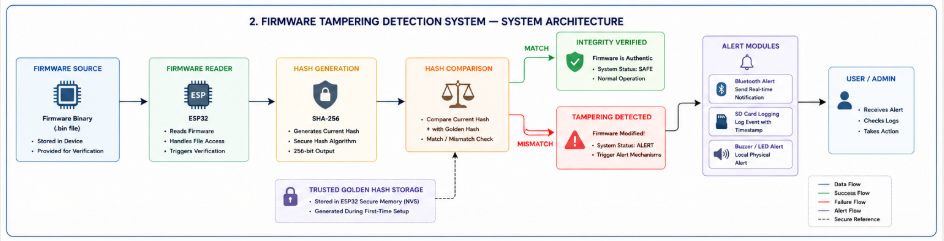

# 🔐 Firmware Tampering Detection System

An embedded security-based firmware integrity verification system designed to detect unauthorized firmware modifications in ESP32 devices using SHA-256 hashing, golden-hash comparison, SD-card logging, and Bluetooth alert mechanisms.

---

## 🚀 Features

* SHA-256 firmware integrity verification
* Golden hash comparison
* ESP32-based embedded implementation
* Bluetooth alert notifications
* SD-card tamper logging
* Lightweight offline verification
* Real-time tampering detection
* Embedded device security monitoring

---
## 🏗️ System Architecture

---

## ⚙️ Workflow

1. Original firmware hash is generated using SHA-256
2. Trusted golden hash is securely stored
3. Current firmware hash is recalculated during verification
4. Current hash is compared with golden hash
5. If mismatch occurs:

   * Tampering is detected
   * Bluetooth alerts are triggered
   * SD-card logs are generated
   * Buzzer/LED warning activates

---

## 🧠 Technologies Used

| Component          | Technology                  |
| ------------------ | --------------------------- |
| Microcontroller    | ESP32                       |
| Hashing Algorithm  | SHA-256                     |
| Communication      | Bluetooth                   |
| Logging            | SD Card Module              |
| Programming        | Embedded C / Arduino        |
| Security Mechanism | Hash Integrity Verification |

---

## 🔒 Security Objective

The system ensures firmware integrity by detecting unauthorized modifications in embedded IoT devices. It helps improve device trustworthiness, security monitoring, and tamper awareness in low-cost environments.

---

## 📌 Future Enhancements

* Secure Boot Integration
* OTA Firmware Verification
* Cloud-based Monitoring
* TPM/Secure Element Support
* AI-based Runtime Anomaly Detection

---

## 📜 License

MIT License
